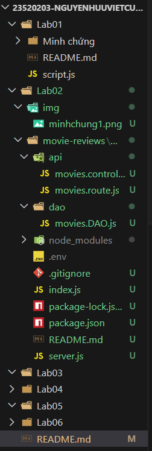
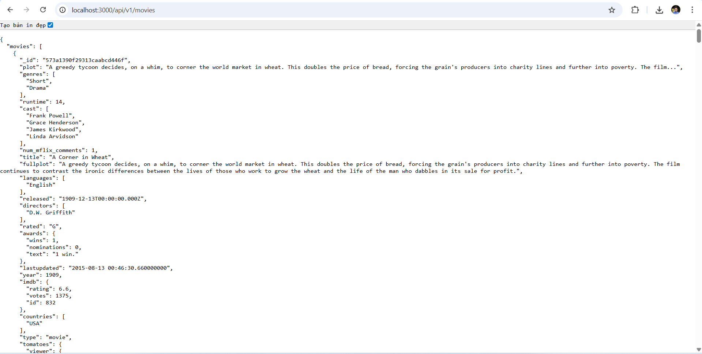

# IE213.Q21 - Kỹ thuật phát triển hệ thống Web

## Thông tin sinh viên
- **Họ tên:** Việt Cường
- **MSSV:** 23520203
- **Lớp:** IE213.Q21.1

## Danh sách các Lab
- [x] **Lab 01:** MONGODB - CRUD Operation
- [x] **Lab 02:** Thiết lập Backend với Node và ExpressJS
- [ ] **Lab 03:** [Chưa thực hiện]
- [ ] **Lab 04:** [Chưa thực hiện]
- [ ] **Lab 05:** [Chưa thực hiện]
- [ ] **Lab 06:** [Chưa thực hiện]

---

## Chi tiết các Lab

### Lab 01: MONGODB - CRUD Operation

**1. Mục tiêu bài thực hành**
- Thiết lập môi trường cơ sở dữ liệu trên đám mây với MongoDB Atlas.
- Cài đặt và cấu hình công cụ quản trị MongoDB Compass.
- Thực hành viết các câu lệnh CRUD (Create, Read, Update, Delete) trực tiếp bằng công cụ MONGOSH.

**2. Công cụ / Môi trường sử dụng**
- **Cloud Database:** MongoDB Atlas.
- **Local GUI:** MongoDB Compass.
- **CLI/Shell:** MONGOSH (tích hợp trong Compass).

**3. Cách chạy chương trình**
1. Mở ứng dụng **MongoDB Compass**.
2. Nhập chuỗi kết nối (URI) lấy từ MongoDB Atlas: `mongodb+srv://23520203:<password>@cluster0.9dnmqvx.mongodb.net/` và nhấn **Connect**.
3. Click vào thanh **`>_ MONGOSH`** ở cạnh dưới màn hình để mở cửa sổ dòng lệnh.
4. Copy và dán lần lượt các câu lệnh từ file `Lab0/script.js` vào MONGOSH và nhấn `Enter` để thực thi.

**4. Kết quả thực hiện**
- **Kết nối thành công MongoDB Atlas qua Compass:**
   
- **Thực thi lệnh:**
  
  

**6. Mức độ hoàn thành**
- Đã hoàn thành: 100% yêu cầu của Lab 01.
- Chưa hoàn thành: Không có.

**7. Khai báo sử dụng AI**
- **Công cụ đã sử dụng:** Google Gemini.
- **Mục đích sử dụng:** Hỗ trợ sửa lỗi môi trường, hỗ trợ viết README.md.
- **Phần được AI hỗ trợ:** 
  - Khắc phục lỗi IP (`SSL alert number 80`) và lỗi xác thực (`bad auth`).
  - Hỗ trợ viết README.md.

---

### Lab 02: Thiết lập Backend với Node và ExpressJS

**1. Mục tiêu bài thực hành**
- Thiết lập môi trường phát triển Node.js.
- Thực hành tạo các tệp tin `server.js`, `index.js`, `api/movies.route.js`.
- Cấu hình kiến trúc Controller và DAO (Data Access Object) để kết nối với MongoDB Atlas.

**2. Công cụ / Môi trường sử dụng**
- **Ngôn ngữ / Nền tảng:** Node.js, npm.
- **Framework/Thư viện:** Express.js, MongoDB Node.js Driver, CORS, dotenv, Nodemon.
- **Database:** MongoDB Atlas (Dataset `sample_mflix`).
- **IDE:** Visual Studio Code.

**3. Cách chạy chương trình**
1. Mở Terminal và di chuyển vào thư mục dự án: `Lab02/movie-reviews/backend`.
2. Chạy lệnh `npm install` để cài đặt các thư viện phụ thuộc (dependencies).
3. Tạo file `.env` ngang hàng với tệp `server.js` và cấu hình chuỗi kết nối:
   - `MOVIEREVIEWS_DB_URI=mongodb+srv://<username>:<password>@cluster.../sample_mflix`
   - `MOVIEREVIEWS_NS=sample_mflix`
   - `PORT=3000`
4. Chạy lệnh `npx nodemon index.js` (hoặc `npm run dev`) để khởi động máy chủ.
5. Mở trình duyệt và truy cập vào đường dẫn: `http://localhost:3000/api/v1/movies`.

**4. Kết quả thực hiện**
- **Thiết lập môi trường thành công:**
  
- **Viết code:**
  
  

**6. Mức độ hoàn thành**
- Đã hoàn thành: 100% yêu cầu của Lab 02.
- Chưa hoàn thành: Không có.

**7. Khai báo sử dụng AI**
- **Công cụ đã sử dụng:** Google Gemini.
- **Mục đích sử dụng:** Hỗ trợ viết README.md.
- **Phần được AI hỗ trợ:** 
  - Hỗ trợ viết README.md.

---

### Lab 03: [Tên bài thực hành Lab 03]
- **Mục tiêu:** [Chưa thực hiện]
- **Trạng thái:** [Chưa thực hiện]

---

### Lab 04: [Tên bài thực hành Lab 04]
- **Mục tiêu:** [Chưa thực hiện]
- **Trạng thái:** [Chưa thực hiện]

---

### Lab 05: [Tên bài thực hành Lab 05]
- **Mục tiêu:** [Chưa thực hiện]
- **Trạng thái:** [Chưa thực hiện]

---

### Lab 06: [Tên bài thực hành Lab 06]
- **Mục tiêu:** [Chưa thực hiện]
- **Trạng thái:** [Chưa thực hiện]